# [Wordlet](https://reubenstr0bel.github.io/Wordlet)

This project is a limited version of the popular NYT game 'Wordle', named 'Wordlet' as a reference to the more limited scope of this project compared to the original. In the game, the user tries to guess a randomised sequence of emojis before they run out of turns. It is aimed at anyone who would enjoy playing a game like this, but was developed mostly for my own educational purposes.

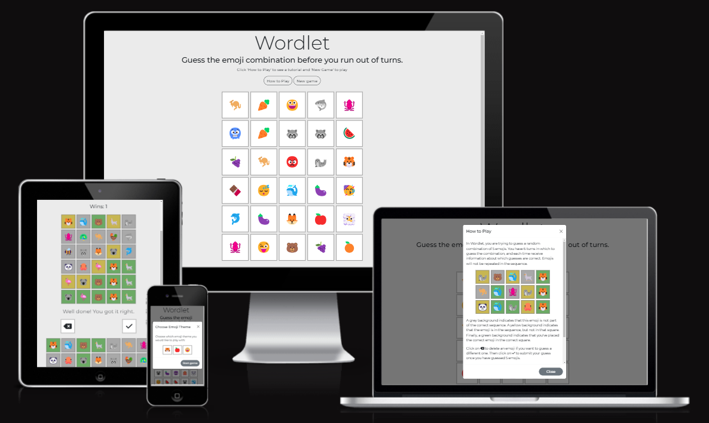

source: [Wordlet amiresponsive](https://ui.dev/amiresponsive?url=https://reubenstr0bel.github.io/Wordlet)

## UX

### The 5 Planes of UX

#### 1. Strategy Plane
##### Purpose
- Provide users with a simple and fun game to play.
- Deliver instant feedback to improve usability.
- Support accessibility and user-friendly interactions.

##### Primary User Needs
- Quickly provide feedback on which guesses were correct.
- Track consecutive wins to encourage playing multiple games.

##### Business Goals
- Encourage users to engage with the app for recreational purposes.

#### 2. Scope Plane
##### Features
- A full list of [Features](#features) can be viewed in detail below.

##### Content Requirements
- Clear instructions for how to interact with the game.
- Results of interaction shown visually.
- Display for tracking consecutive wins.

#### 3. Structure Plane
##### Information Architecture
- **Hierarchy**:
  - Single page with game content and tutorial information
  - Clear and prominent placement of the buttons used for input.

##### User Flow
1. User lands on the home page → can read brief instructions in a modal or start a new game.
2. If starting a new game → selects an emoji theme in a modal.
3. Inputs 5 emojis at a time, submits their guess and receives feedback.
4. Continues guessing until correct or out of turns.
5. Can choose to start a new game → presented with emoji theme choice again.

#### 4. Skeleton Plane
##### Wireframe Suggestions
- The layout for this page was influenced primarily by the layout for the original Wordle game, with the keyboard below a game grid. For simplicity, Wordlet is made with just one webpage as there is no feature to create an account and a landing page wouldn't serve much purpose.

#### 5. Surface Plane
##### Visual Design Elements
- **[Colours](#colour-scheme)**: see below.
- **[Typography](#typography)**: see below.

### Colour Scheme

I used the same colour scheme as Wordle to represent incorrect/wrong location/correct guesses. The background is just a simple grey to bring attention to the game itself.

- `#C8B653` Correct guesses.
- `#6CA965` Wrong location guesses.
- `Dark grey` incorrect guesses.
- `#EBEBEB` Background colour.

### Typography

- [Montserrat](https://fonts.google.com/specimen/Montserrat) was used with a back-up of sans-serif.
- [Font Awesome](https://fontawesome.com) icons were used for the backspace and submit buttons.
- [Emojipedia](https://emojipedia.org/) Emojis used are from Emojipedia.
- [Favicon.io](https://favicon.io/) The favicon uses an emoji from Favicon.io.

## User Stories

| Target | Expectation | Outcome |
| --- | --- | --- |
| As a user | I would like to click on emojis to add them to the sequence | so that I can guess the combination. |
| As a user | I would like the application to show me which emojis are correct | so that I can make my next guess closer to the answer. |
| As a user | I would like visual feedback to be shown instantly after making a guess | so that I get my result quickly without waiting. |
| As a user | I would like the application to have clear and large buttons | so that I can easily select the correct one on any device. |
| As a user | I would like the application to have high-contrast colors and accessible fonts | so that I can easily read and interact with it. |
| As a user | I would like clear labels and instructions | so that I understand how to use the app without confusion. |
| As a user | I would like the app to show me the correct result if I run out of guesses | so that I can see how close I was to the correct answer. |
| As a user |  I would like to see how many sequences I get correct | so I can challenge myself or others to beat my score. |
| As a user | I would like to see a 404 error page if I get lost | so that it's obvious that I've stumbled upon a page that doesn't exist. |

## Features

### Existing Features

| Feature | Notes | Screenshot |
| --- | --- | --- |
| Instructions | The game page loads with a prompt to open the tutorial modal and which button to click to begin the game | 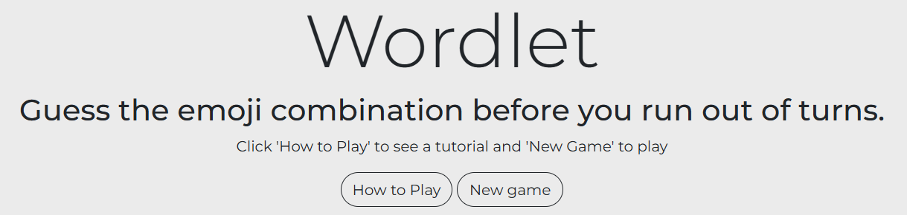 |
| Tutorial | The tutorial modal shows how the game works and what the various colours mean | 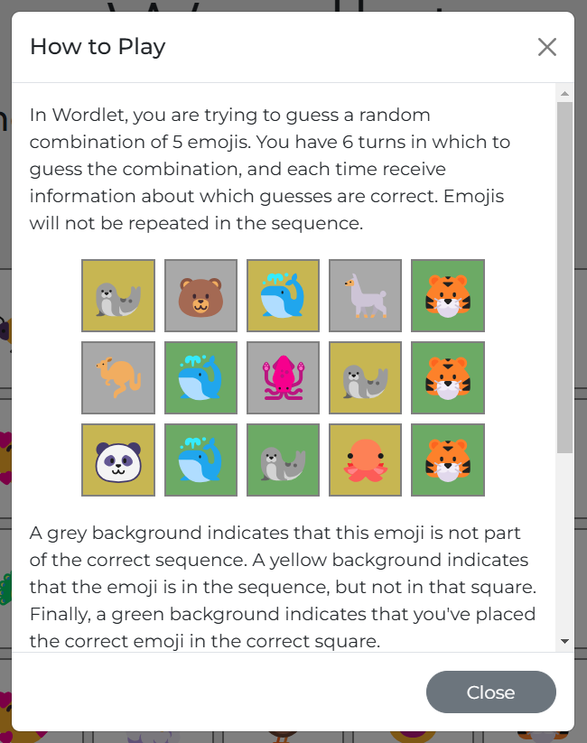 |
| Choose theme | Clicking the new game button opens a modal where the user can choose which category of emoji they want to play the game with. The selected emoji is coloured in green to confirm the choice | 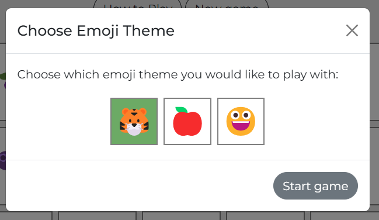 |
| Emoji keyboard | The keyboard is filled with emojis from the chosen theme. There is also a backspace and submit button separated from the main keyboard. | 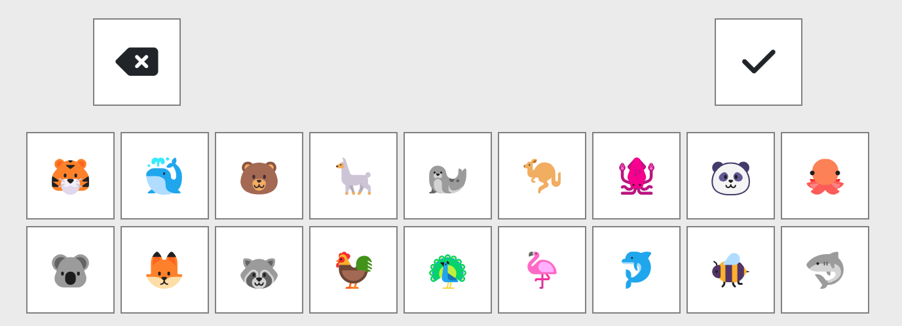 |
| Guess a sequence and receive feedback | When clicked on the keyboard, emojis are entered into a row on the game grid. When the guess is submitted the background colour of each emoji changes to show whether each is correct or not | 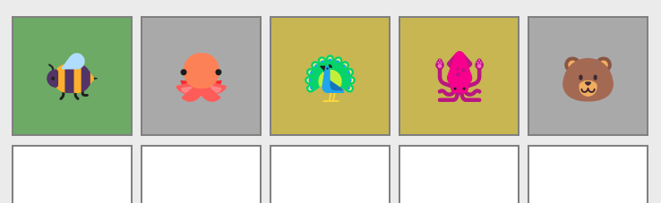 |
| Show previous guesses | The keyboard itself also updates with colured backgrounds to show which emojis have been guessed already and whether they were correct. This improves the user experience and makes it quicker to play the game and decide which guess to make | 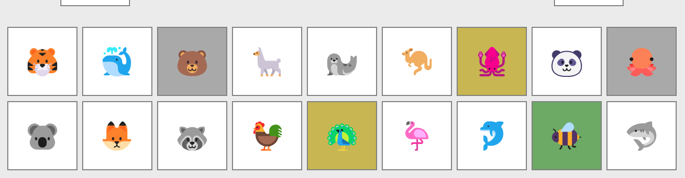 |
| Display congratulatory message | If the correct sequence is guessed, a congratulatory message is displayed | 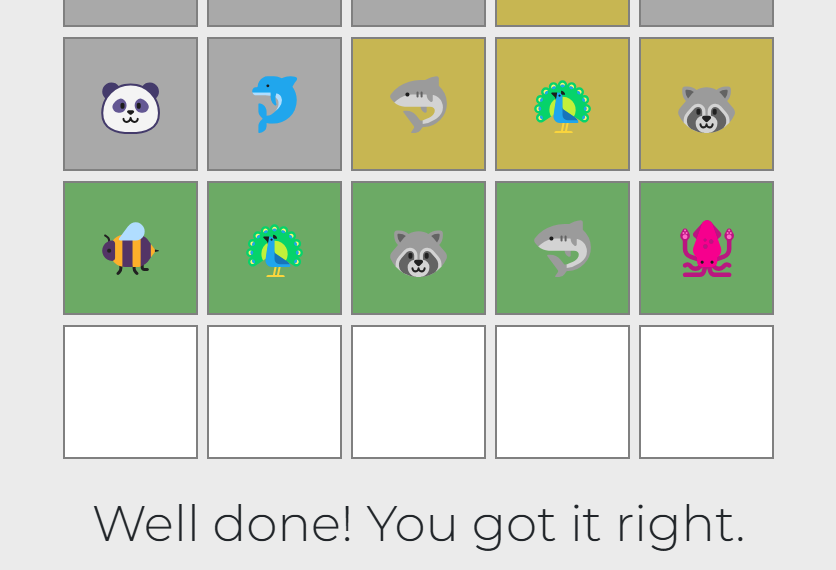 |
| Display correct sequence | If the correct sequence is not guessed in time, the correct sequence is shown | 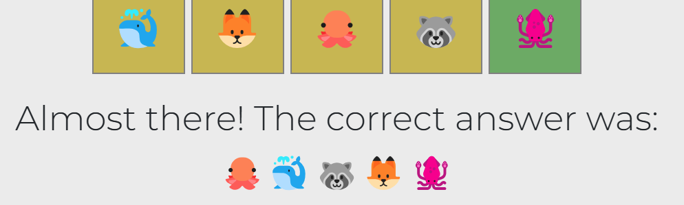 |
| Display win counter | The number of wins is shown at the top of the screen. Losing a game resets the counter | 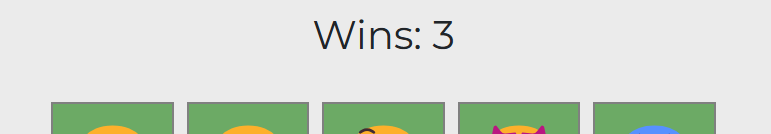 |
| 404 | The 404 error page will indicate when a user has somehow navigated to a page that doesn't exist. This replaces the default GitHub Pages 404 page. This page features a link back to the main page | 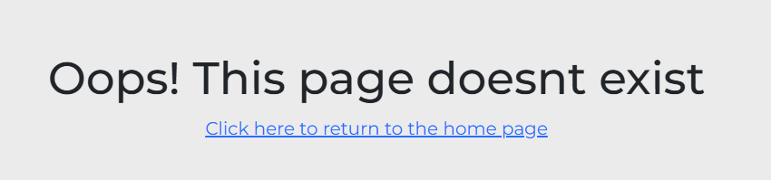 |

### Future Features

- **Landing Page**: Add a home page to link to the game and possibly different game modes.
- **User Account**: Allow the user to create an account and log in to track their score or playing streak.
- **Other emoji categories**: Add more different categories of emojis to choose from.

## Tools & Technologies

| Tool / Tech | Use |
| --- | --- |
|  | Generate README and TESTING templates. |
|  | Version control. (`git add`, `git commit`, `git push`) |
|  | Secure online code storage. |
|  | Cloud-based IDE for development. |
|  | Main site content and layout. |
|  | Design and layout. |
|  | User interaction on the site. |
|  | User interaction on the site. |
|  | Hosting the deployed front-end site. |
|  | Front-end CSS framework for modern responsiveness and pre-built components. |
|  | Automated JavaScript testing. |
|  | Icons. |
| [Favicon.io](https://favicon.io/) | Favicon |

## Testing

> [!NOTE]
> For all testing, please refer to the [TESTING.md](TESTING.md) file.

## Deployment

### GitHub Pages

The site was deployed to GitHub Pages. The steps to deploy are as follows:

- In the [GitHub repository](https://www.github.com/ReubenStr0bel/Wordlet), navigate to the "Settings" tab.
- In Settings, click on the "Pages" link from the menu on the left.
- From the "Build and deployment" section, click the drop-down called "Branch", and select the **main** branch, then click "Save".
- The page will be automatically refreshed with a detailed message display to indicate the successful deployment.
- Allow up to 5 minutes for the site to fully deploy.

The live link can be found on [GitHub Pages](https://reubenstr0bel.github.io/Wordlet).

### Local Development

This project can be cloned or forked in order to make a local copy on your own system.

#### Cloning

You can clone the repository by following these steps:

1. Go to the [GitHub repository](https://www.github.com/ReubenStr0bel/Wordlet).
2. Locate and click on the green "Code" button at the very top, above the commits and files.
3. Select whether you prefer to clone using "HTTPS", "SSH", or "GitHub CLI", and click the "copy" button to copy the URL to your clipboard.
4. Open "Git Bash" or "Terminal".
5. Change the current working directory to the location where you want the cloned directory.
6. In your IDE Terminal, type the following command to clone the repository:
	- `git clone https://www.github.com/ReubenStr0bel/Wordlet.git`
7. Press "Enter" to create your local clone.

Alternatively, if using Gitpod, you can click below to create your own workspace using this repository.

**Please Note**: in order to directly open the project in Gitpod, you should have the browser extension installed. A tutorial on how to do that can be found [here](https://www.gitpod.io/docs/configure/user-settings/browser-extension).

#### Forking

By forking the GitHub Repository, you make a copy of the original repository on your GitHub account to view and/or make changes without affecting the original owner's repository. You can fork this repository by using the following steps:

1. Log in to GitHub and locate the [GitHub Repository](https://www.github.com/ReubenStr0bel/Wordlet).
2. At the top of the Repository, just below the "Settings" button on the menu, locate and click the "Fork" Button.
3. Once clicked, you should now have a copy of the original repository in your own GitHub account!

### Local VS Deployment

There are no major differences between the local version when compared to the deployed version online.

## Credits

### Content

| Source | Notes |
| --- | --- |
| [Markdown Builder](https://markdown.2bn.dev) | Help generating Markdown files |
| [Bootstrap](https://getbootstrap.com) | Various components and layout |
| [W3Schools](https://www.w3schools.com/) | Help with JavaScript, CSS, HTML, and JQuery code |

### Media

| Source | Notes |
| --- | --- |
| [favicon.io](https://favicon.io) | Generating the favicon |
| [Font Awesome](https://fontawesome.com) | Icons used throughout the site |
| [Emojipedia](https://emojipedia.org/) | Emojis used for the game |

### Acknowledgements

- I would like to thank my Code Institute mentor, [Tim Nelson](https://www.github.com/TravelTimN) for his generous support throughout the development of this project.