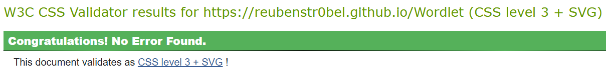
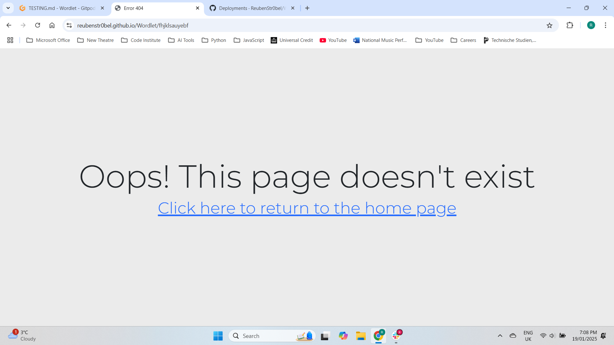
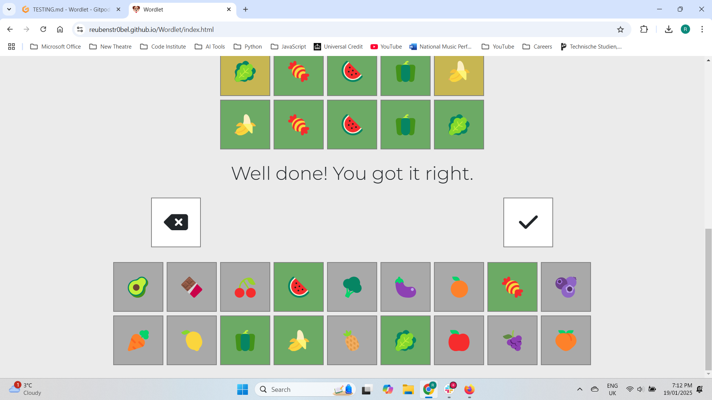
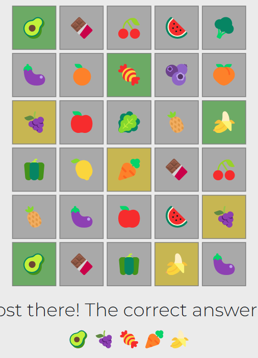

# Testing

> [!NOTE]
> Return back to the [README.md](README.md) file.

## Code Validation

### HTML

I have used the recommended [HTML W3C Validator](https://validator.w3.org) to validate all of my HTML files.

| Directory | File | URL | Screenshot | Notes |
| --- | --- | --- | --- | --- |
|  | [index.html](https://github.com/ReubenStr0bel/Wordlet/blob/main/index.html) | [HTML Validator](https://validator.w3.org/nu/?doc=https://reubenstr0bel.github.io/Wordlet/index.html) |  | The validator recommended changing some sections to divs as there weren't any heading elements in these sections and adding a heading for them was not appropriate. |
|  | [404.html](https://github.com/ReubenStr0bel/Wordlet/blob/main/404) | [HTML Validator](https://validator.w3.org/nu/?doc=https://reubenstr0bel.github.io/Wordlet/404) |  | No notes |


### CSS

I have used the recommended [CSS Jigsaw Validator](https://jigsaw.w3.org/css-validator) to validate all of my CSS files.

| Directory | File | URL | Screenshot | Notes |
| --- | --- | --- | --- | --- |
| assets | [styles.css](https://github.com/ReubenStr0bel/Wordlet/blob/main/assets/css/styles.css) | [CSS Validator](https://jigsaw.w3.org/css-validator/validator?uri=https://reubenstr0bel.github.io/Wordlet) |  | No notes |


### JavaScript

I have used the recommended [JShint Validator](https://jshint.com) to validate all of my JS files.

| Directory | File | URL | Screenshot | Notes |
| --- | --- | --- | --- | --- |
| assets | [script.js](https://github.com/ReubenStr0bel/Wordlet/blob/main/assets/scripts/script.js) | N/A |  | The functions declared within loops are from code that creates similar event listeners for a large number of buttons, where each button needs to have a slightly different function depending on its ID. The undefined variable 'module' is used to import functions for Jest testing, and that section of code is derived from the documentation for Jest. |


## Responsiveness

I've tested my deployed project to check for responsiveness issues.

| Page | Mobile | Tablet | Desktop | Notes |
| --- | --- | --- | --- | --- |
| Home |  |  |  | Works as expected. On smaller screen sizes the keyboard and gameboard just about fit on screen together, but on larger screens you need to scroll up and down while playing to go from viewing the keyboard to the top row of the game board. |
| 404 |  |  |  | Works as expected. |

## Browser Compatibility

I've tested my deployed project on multiple browsers to check for compatibility issues.

| Page | Chrome | Firefox | Edge | Notes |
| --- | --- | --- | --- | --- |
| Home |  |  |  | Works as expected. There is some difference between the visual appearance of emojis between browsers, but all browsers displayed them without issue. |
| 404 |  |  |  | Works as expected |

## Lighthouse Audit

I've tested my deployed project using the Lighthouse Audit tool to check for any major issues. Some warnings are outside of my control, and mobile results tend to be lower than desktop.

| Page | Mobile | Desktop |
| --- | --- | --- |
| Home |  |  |
| 404 |  |  |

## Defensive Programming

Defensive programming was manually tested with the below user acceptance testing:

| Page/Feature | Expectation | Test | Result | Screenshot |
| --- | --- | --- | --- | --- |
| Tutorial modal | 'How to Play' button displays tutorial modal | Clicked button | Tutorial modal displays |  |
| New game options modal | 'New Game' button opens modal to select emoji theme | Clicked button | Options modal displays |  |
| Selecting emoji theme | Clicking an emoji button in the options modal sets the emoji theme, and clicking 'Start game' applies this theme to the emoji keyboard | Clicked animal button and 'Start game' | The animal emoji set was applied to the emoji keyboard |   |
| Emoji keyboard | Emojis are added into the game row when clicked, the most recent is deleted when backspace is clicked, and a guess is submitted only when the row is full and the submit button is clicked | Each emoji button was clicked, the backspace button was tested at each space on the game grid, and submit was attemped on every space as well. | Emojis are added in order, deleted by backspace in reverse order, and the submit button doesn't do anything if the row is not full. |  |
| Background colour changes | The background colour of both the emoji keyboard buttons and the game grid tiles changes to indicate whether the guess was correct | Played multiple games in which all emoji buttons were used as a guess | Background colours update in the game grid and on the keyboard as expected |    |
| Keyboard disables | The keyboard buttons don't function when the game is won with turns remaining or the game is over | Correct response was entered in first turn, buttons then clicked to check nothing happens. Then game was lost and same test performed. | Button presses have no effect once game is won or over |   |
| Win/loss message | If the game is won then a congratulatory message is shown, if the game is lost then the correct answer is displayed | A game was won and lost to check the resulting message | A win displayed the correct message, a loss displays the correct answer |   |
| Clear game grid | Clicking new game after playing resets the game grid and keyboard to the chosen emoji theme | Game played and then a new game started | Game grid is cleared and emoji keyboard is updated if a new emoji theme is chosen |  |
| Initial load page design | Page loads with randomised emojis in game grid and the keyboard elements are hidden | Page reloaded | As expected |  |
| 404 Error Page | Feature is expected to display a 404 error page for non-existent pages. | Navigated to an invalid URL (e.g., `/test`) to test error handling. | A custom 404 error page was displayed as expected. |  |

## User Story Testing

| Target | Expectation | Outcome | Screenshot |
| --- | --- | --- | --- |
| As a user | I would like to click on emojis to add them to the sequence | so that I can guess the combination. |  |
| As a user | I would like the application to show me which emojis are correct | so that I can make my next guess closer to the answer. |  |
| As a user | I would like visual feedback to be shown instantly after making a guess | so that I get my result quickly without waiting. | Refer to screenshot above to see this feature, I can't indicate the speed of the response in an image. |
| As a user | I would like the application to have clear and large buttons | so that I can easily select the correct one on any device. |  |
| As a user | I would like the application to have high-contrast colors and accessible fonts | so that I can easily read and interact with it. |  |
| As a user | I would like clear labels and instructions | so that I understand how to use the app without confusion. |   |
| As a user | I would like the app to show me the correct result if I run out of guesses | so that I can see how close I was to the correct answer. |  |
| As a user |  I would like to see how many sequences I get correct | so I can challenge myself or others to beat my score. |  |
| As a user | I would like to see a 404 error page if I get lost | so that it's obvious that I've stumbled upon a page that doesn't exist. |  |

## Automated Testing

I attempted to conduct a series of automated tests on my application. There were a few issues encoutered with this, detailed in the section below.

> [!NOTE]
> I fully acknowledge and understand that, in a real-world scenario, an extensive set of additional tests would be more comprehensive.

### JavaScript (Jest Testing)

I have used the [Jest](https://jestjs.io) JavaScript testing framework to test the application functionality. In order to work with Jest, I first had to initialize NPM.

- `npm init`
- Hit `<enter>` for all options, except for **test command:**, just type `jest`.

Add Jest to a list called **Dev Dependencies** in a dev environment:

- `npm install --save-dev jest`

**IMPORTANT**: Initial configurations

When creating test files, the name of the file needs to be `file-name.test.js` in order for Jest to properly work. Without the following, Jest won't properly run the tests:

- `npm install -D jest-environment-jsdom`

Due to a change in Jest's default configuration,  the following code needs to be added to the top of the `.test.js` file:

```js
/**
 * @jest-environment jsdom
 */

const { test, expect } = require("@jest/globals");
const { function1, function2, function3, etc. } = require("../script-name");

beforeAll(() => {
    let fs = require("fs");
    let fileContents = fs.readFileSync("index.html", "utf-8");
    document.open();
    document.write(fileContents);
    document.close();
});
```

Finally, at the bottom of the script file where the primary scripts are written, include the following. The names of all of the functions that are being tested in the `.test.js` file should be included here.

```js
if (typeof module !== "undefined") module.exports = {
    function1, function2, function3, etc.
};
```

Now that these steps have been undertaken, further tests can be written, and be expected to fail initially. Write JS code that can get the tests to pass as part of the Red-Green refactor process. Once ready, to run the tests, use this command:

- `npm test`

**NOTE**: To obtain a coverage report, use the following command:

- `npm test --coverage`

#### Jest Test Issues

I encountered some major issues with Jest while trying to test the application. Primarily, I couldn't get Jest to recognise the dollar symbol used in JQuery so i received reference errors when trying to run the tests. I tried to install JQuery with npm using 'npm install jquery' and including 'const $ = require("jquery")' at the top of my testing file. Unfortunately this didn't solve the issue so I was unable to get any of my Jest tests to run.

| Reference Error |
| --- |
|  |

## Bugs

### Fixed Bugs
| Issue | Fix | Screenshot |
| --- | --- | --- |
| The way the answer was being stored and then retrieved by the handleSubmit function. The way I had written it meant the code was trying to compare the guessed emoji as a string to a DOM object. | Added `.innerText` and a method of saving the answer as a string so that I could use `.includes()` to determine if the emoji is included within the answer. |  |
| Clicking backspace when the game row was empty set the gameCol variable to 0, so that the next emoji button press didn't update the game grid as the grid is numbered 1-5 | Changed the if statement in the backspace event listener function to check for `gameCol > 1` instead of 0 |  |
| The background colour changes didn't update a yellow guess into a green one when the correct spot was found | The class to make the background yellow was still present, so I added an if statement to check for current classes and remove them if appropriate before adding the new class. |  |
| After playing games consecutively clicking an emoji button would add several copies of the emoji onto the game grid | Event listeners were being added in the newGame function, which is called every time a game is started. This meant each button had multiple event listeners doing the same thing. I removed this code from the newGame function so it only runs once. |  |
| Both the congratulatory text and the correct answer displayed if the game was won in the last turn | The if statement to check whether the game was won or lost and call the result function was contained with the for loop that checks each emoji against the answer. On the final row, the result function was being called with the loss value for every emoji until the final one when the number of correct guesses reached 5. I removed the if statement from the for loop. |  |

### Known Issues

> [!IMPORTANT]
> There are no remaining bugs that I am aware of, though, even after thorough testing, I cannot rule out the possibility.